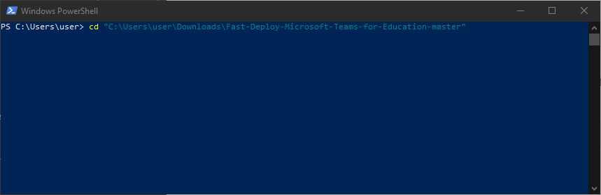
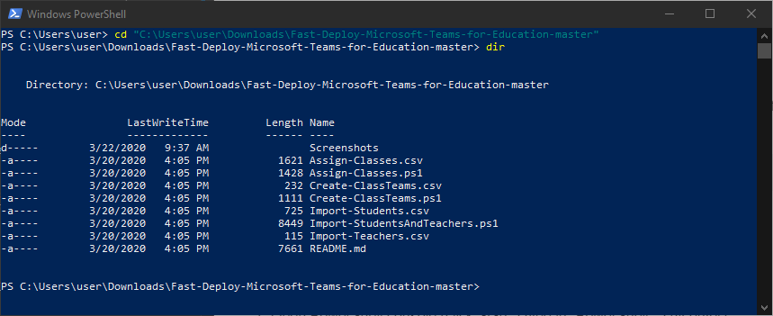
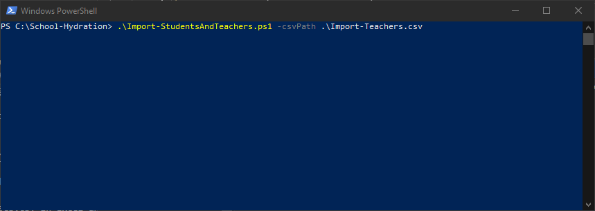
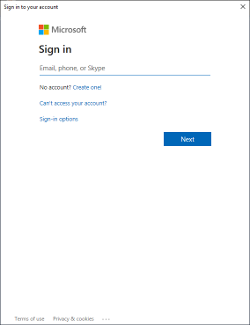
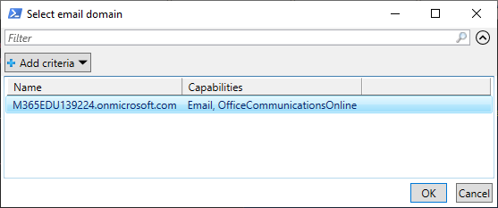
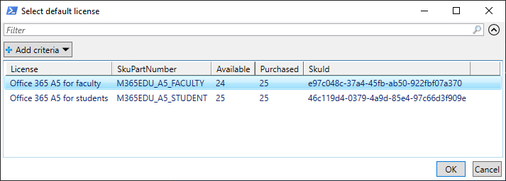
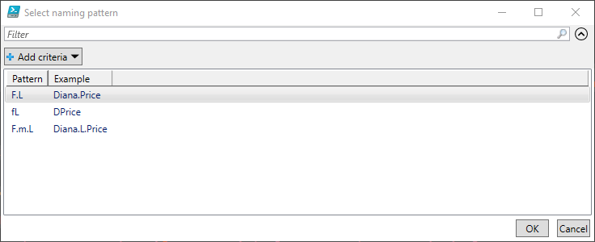
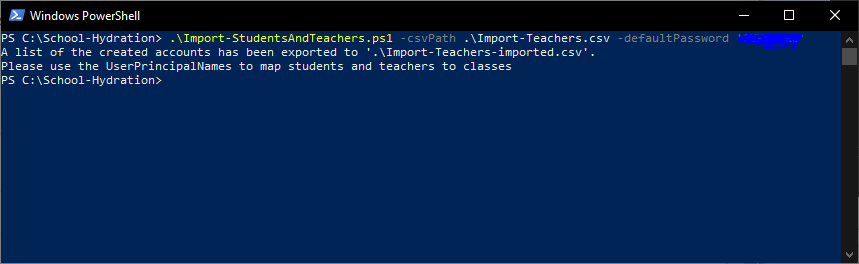
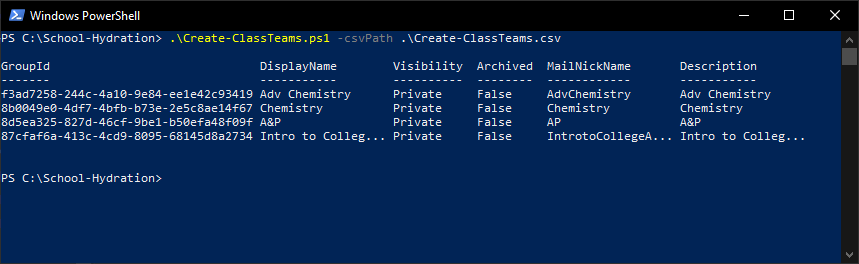
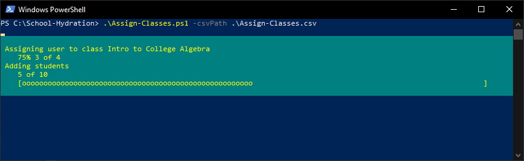

# Fast Deploy Microsoft Teams for Education

These set of scripts are designed to help small schools, co-ops, and tutors quickly get up and running using Microsoft Teams. If you are a large school with your own IT staff, you are welcome to use this as well, but the official [School Data Sync](https://sds.microsoft.com/) from Microsoft might be a better option for you. 

This solution will help you creating logins and emails for all students and teachers, create a Teams site for each class, and assigning the teacher and students to the correct classes.

I realize that not everyone who is in need of the solution, is a PowerShell guru. So I have provided detailed steps below on how you can implement this for your school. If you have any questions or issues with this script, please feel free to reach out to me on Twitter [@mdowst](https://twitter.com/MDowst).

# Overview
## Requirements
- Global admin rights to the Office 365 tenant
- [AzureAD PowerShell Module](https://www.powershellgallery.com/packages/AzureAD/2.0.2.4)
- [MicrosoftTeams PowerShell Module](https://www.powershellgallery.com/packages/MicrosoftTeams/1.0.5)

Don't worry if you don't know what this means. Instructions for installing them are provided in the detail instructions below.

## Importing Students and Teachers

Students and teachers are both imported using the same script. If you already have Office 365 accounts for your students and teachers, you can skip this step and go to the class creation scripts. If you are assigning different licenses to teacher and students, it is recommended that you create separate files for teachers and students, then run the script once for each. See the sample CSV file Import-Teachers.csv and Import-Students.csv for examples of how to format your data. You only need to enter their first and last name and if they are a teacher, student, or faculty. The middle name is optional. The Id field is also optional, but highly recommended. The usernames will be auto-generated and if two people have the same name, a number will appended to the end of their username. The Id field is used as a check to prevent you from accidentally creating duplicate accounts, in a situation where you imported the same person twice.

When the start the script you will be prompted to enter your credentials for your Office 365 tenant, to choose the email domain, the licenses you want to assign, and the naming pattern to use. You have 3 choices for the naming pattern these are:

- **F.L**: First name (period/full stop) Last name. ex. Diana.Price
- **fL**: First initial Last name. ex. DPrice
- **F.m.L**: First name (period/full stop) Middle initial (period/full stop) Last name. ex. Diana.L.Price

When the script completes it will output a second CSV file in the same path as the original with "-imported" appended to the file name. This file will contain the UserPrincipalName for each account created. You will use this UserPrincipalName to assign the teachers and students to their correct classes.

## Create Team sites for Classes

Once you have your user accounts created, you can now create a Team site for each class. All you need to do is provide a CSV file with the name of the class and the teacher. Each class name must be unique, and the teacher value must be the UserPrincipalName that was created by the import process and found in the CSV it exported. See the CSV Create-ClassTeams.csv for an example. 

To import your classes simply run the **Create-ClassTeams.ps1**, passing in the path to your CSV file. One you start the script you will be prompted to enter your credentials, then it will start creating the Teams sites.

## Assign Students to Classes

Now that you have your user accounts created and your Team sites setup, you can now assign students to their classes. To do this you need a CSV file with the name of the class and the UserPrincipalName of the student to assign to it. See the CSV Assign-Classes.csv for an example. 

To assign students to classes run the **Assign-Classes.ps1**, passing in the path to your CSV file. One you start the script you will be prompted to enter your credentials, then it will go through and assign all the student to their classes.

# Detailed Instructions

These instructions assume that you are running Windows 10, and that you have an Office 365 for Education subscription from Microsoft. If you don't have a subscription, my colleague Cameron Fuller has written a blog post detailing how you can setup with a subscription for your school. You can find it here - [Camerons Post](TBD).

It uses PowerShell which is a task-based command-line shell and scripting language built into Windows. While they may work in some older versions of Windows, and even Mac or Linux, it is dependent on certain PowerShell versions, which Windows 10 has by default.

PowerShell and the PowerShell modules required by this solution are created and maintained by Microsoft and are of free. This solution is open to the public and is also free of charge. You do not need to purchase any software to use this solution.

Note: Any time you see to enter a command in the instructions, assume that you will need to press the **Enter** key afterwards.

## Download Scripts
1. At the top of this page click the Clone of download button
2. Select Download Zip


3. When the download completed extract the zip file

## Starting PowerShell
Option 1 - From Start Menu
1. Click **Start**
2. Type **PowerShell**
3. Click **Windows PowerShell**

Option 2 - From Run
1. Press simultaneously the **Windows** and **R** on your keyboard
2. Type **PowerShell**
3. Click **OK** or press **Enter**

## Navigate to the folder with the script files
1. In the PowerShell console enter the command "cd" followed by the path to the folder you extracted. For example:
```powershell
cd "C:\Users\user\Downloads\Fast-Deploy-Microsoft-Teams-for-Education-master"
```



2. To ensure you are in the correct place type ```dir```. You should see the names of the ps1 and csv files listed.



## Install Required Modules
1. Open PowerShell console (click Start > type in "PowerShell" > hit enter)
2. Install the Azure AD module using the command:
```powershell
Install-Module AzureAD -Scope CurrentUser
```
3. If prompt to trust repository enter ```Y``` for Yes.
4. Install the Microsoft Teams module using the command:
```powershell
Install-Module MicrosoftTeams -Scope CurrentUser
```
5. Again, if prompt to trust repository enter Y for Yes.

## Import Teachers and Students
Before beginning ensure you have reviewed the [Importing Students and Teachers](#importing-students-and-teachers) section of the Overview to ensure you to properly created your import CSV files.
1. Open the Import-Teachers.csv and Import-Students.csv in Excel and enter the information for your school.
2. Save a close the CSV files.
3. In the PowerShell console ensure you are in the folder you extracted the zipped files to.
4. Start the teacher import by running the command below. If your CSV is in the same folder as your script you can leave the path as .\\. Otherwise you will need to provide the full path.
```powershell
.\Import-StudentsAndTeachers.ps1 -csvPath .\Import-Teachers.csv -defaultPassword 'AStrongPassword'
```



5. You will see a prompt to enter your username and password for Office 365. Enter your username and password for your global admin account.



6. Next you will be prompted to select the email domain for the users. Highlight the one you want to use and click OK



7. Next you will be prompted to select the license to assign to the users. Highlight the one you want to use and click OK



8. Next you will be prompted to select the naming convention to use for you user accounts. Highlight the one you want to use and click OK



9. Once the import completes it will tell you where the exported CSV file is. You will need this later for creating the classes and assigning the students.



10. Repeat the process above for the Import-Students.csv file.

## Create Class Teams
Before beginning ensure you have reviewed the [Create Team sites for Classes](#Create-Team-sites-for-Classes) section of the Overview to ensure you to properly created your import CSV files.
1. Open the Create-ClassTeams.csv in Excel and enter the information for your school. The class names should all be unique and the value in the teacher column should be the UserPrincipalName found in the export file from the teacher import. 
2. In the PowerShell console ensure you are in the folder you extracted the zipped files to.
3. Start the class creation by running the command below. If your CSV is in the same folder as your script you can leave the path as .\\. Otherwise you will need to provide the full path.
```powershell
.\Create-ClassTeams.ps1 -csvPath .\Create-ClassTeams.csv
```

4. You will see a prompt to enter your username and password for Office 365. Enter your username and password for your global admin account.


5. You will see a list of the Team sites as they are created. The teacher will automatically be added as the Owner of the Team.




## Assign Students to Classes

1. Open the Assign-Classes.csv in Excel and enter the information for your school. The class names should match the names from the Create-ClassTeams.csv and the value in the student column should be the UserPrincipalName found in the export file from the student import. 
2. In the PowerShell console ensure you are in the folder you extracted the zipped files to.
3. Start the class assignment below by running the command below. If your CSV is in the same folder as your script you can leave the path as .\\. Otherwise you will need to provide the full path.
```powershell
.\Assign-Classes.ps1 -csvPath .\Assign-Classes.csv
```

4. You will see a prompt to enter your username and password for Office 365. Enter your username and password for your global admin account.


5. Once the script completes you are finished.

