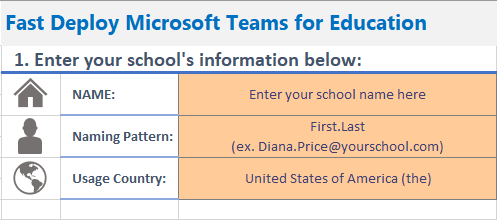
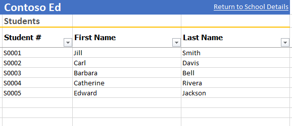
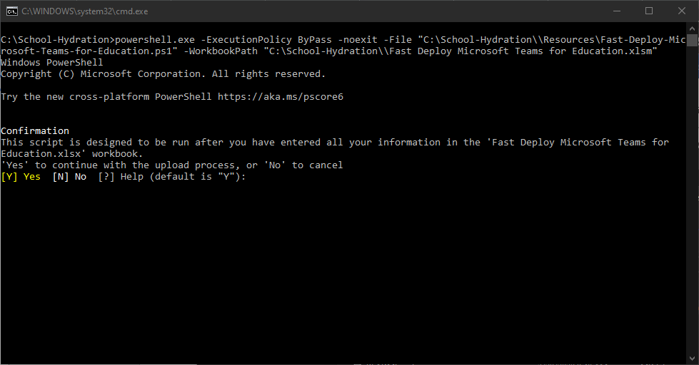
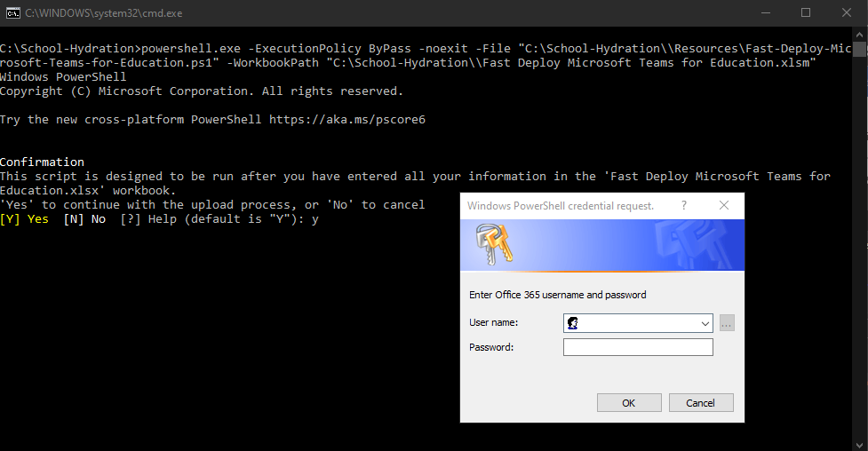
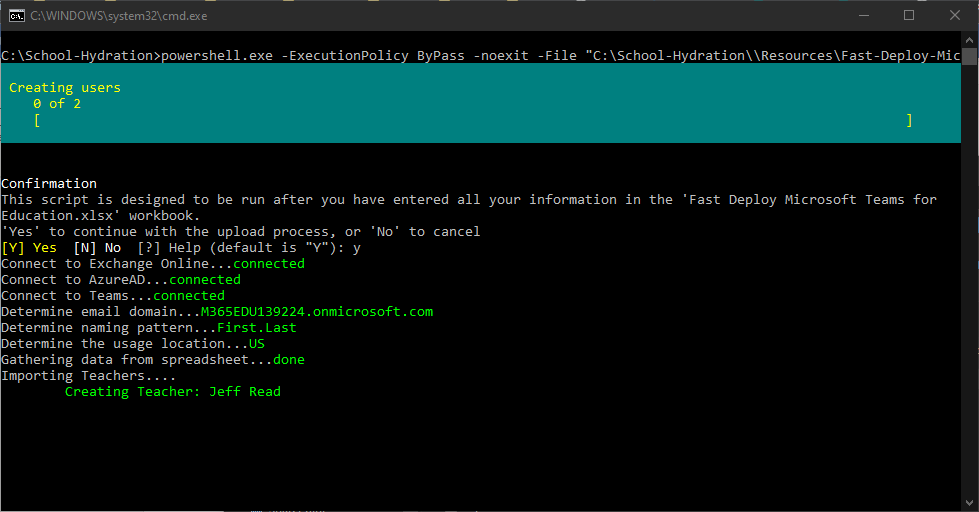
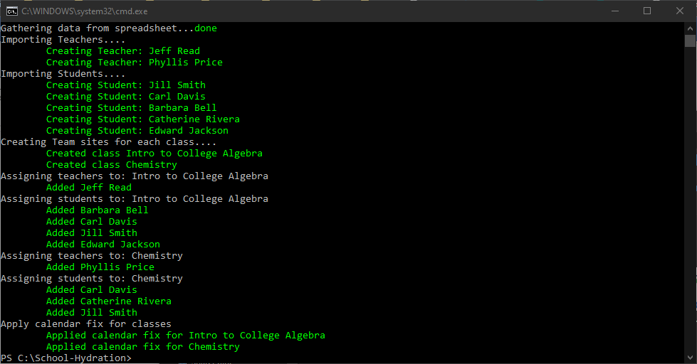

# Fast Deploy Microsoft Teams for Education

This solution is designed to help small schools, co-ops, and tutors quickly get up and running using Microsoft Teams. If you are a large school with your own IT staff, you are welcome to use this as well, but the official [School Data Sync](https://sds.microsoft.com/) from Microsoft might be a better option for you. 

This solution will help you creating logins and emails for all students and teachers, create a Teams site for each class, and assigning the teacher and students to the correct classes.

We realize that not everyone who is in need of the solution, is a technology guru. So, we have tried to make it as simple as possible to implement this for your school. If you have any questions or issues with this solution, please feel free to reach out to me on Twitter [@mdowst](https://twitter.com/MDowst).

# Overview
## Requirements
- Microsoft Excel
- Windows 10
- Office 365 Subscription with Education Licenses\
*Note: If you don't have a subscription, my colleague Cameron Fuller has written a blog post detailing how you can setup with a subscription for your school. You can find it here - [Cameron's Post](https://www.catapultsystems.com/blogs/how-to-build-your-school-in-microsoft-teams/).*
- Teams is enabled for your students and teachers.\
See the [Students are unable to access Teams](#students-are-unable-to-access-teams) section for directions on doing this. 

# Getting Started

## Download this solution
1. At the top of this page click the Clone of download button
2. Select Download Zip

3. When the download completed extract the zip file

## Building your school
1. Open the **Fast Deploy Microsoft Teams for Education.xlsx** workbook in Excel.
2. On the **School Details** sheet, enter your school's name, choose a naming convention for your logins, and select the country you are in.

3. On the **Teachers** sheet, enter the first and last name of your teachers.

4. On the **Students** sheet, enter the first and last name of your students.

5. On the **Classes** sheet, enter the name of the class, then use the dropdowns to assign the teachers and students.\
*Note: Class names must be unique, and only need to be entered once. All teachers and student listed in the rows below will be added to that class.*

6. Once you've entered all your information, save and close the workbook.

## Uploading your school's information
1. Double-click on the file **Start-Upload.bat**.
2. When the file starts you will be prompted to confirm you've already filled out the **Fast Deploy Microsoft Teams for Education.xlsx** workbook. Enter **Y** and press **Enter** to continue.

3. Next you will be prompted for your username and password. This is the username and password for your Office 365 subscription. The username will most likely end with .onmicrosoft.com.

4. The solution will then attempt to connect to the different Microsoft services, and start building your school.

5. Depending on your subscription and licenses you may receive some additional prompts. If you don't match any of the conditions below, the solution will just continue on. 
    1. __Select email domain__: If your subscription contains more than one email domain, then you will be prompted to select which one to assigned to the users being created.
    2. __Select naming pattern__: If for some reason is cannot find the naming pattern in the workbook, it will prompt you for it.
6. The solution will then start building your school. Once it is finished you are all set.

# Making Changes
This solution is designed to be run multiple times. If you have additional teachers, students, or classes to add, simply add them to the **Fast Deploy Microsoft Teams for Education.xlsx** workbook and run the **Start-Upload.bat** again. As long as the Teacher # and Student # do not change no user will be duplicated. This solution also only adds, it will never remove or change an existing user or Team site.  

# FAQ and Known Issues
## Students are unable to access Teams
**Issue/Question:** Some students may see a message that says, "You're missing out!" or "Ask your admin to enable Microsoft Teams for..."

**Resolution:** Be sure to Enable Microsoft Teams for your school. In EDU tenants, Teams isn't enabled by default; you'll have to turn it on first. Follow the link below for direction on how to enable Teams.
https://docs.microsoft.com/en-us/microsoft-365/education/intune-edu-trial/enable-microsoft-teams

## Teams and video focus
**Issue/Question:** Teams is currently limited to only 4 videos at a time and cannot go beyond that. This is difficult when teach a class because the instructor can’t watch all students such as when they are taking a test or during class to see if they are paying attention. 

**Workaround:** For now, the best option appears to be to pin a video for the specific students you want to keep an eye on. 
**Current state:** This is #1 on feedback request, especially for teachers, so Microsoft is aware of this and are working on a solution.

